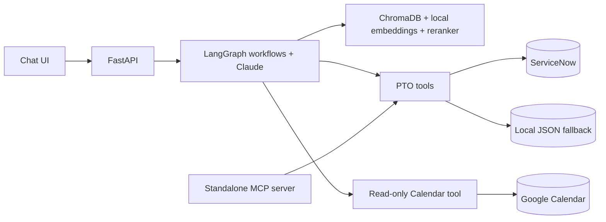

# PTO Agent: Agentic Time-Off Management Assistant

An AI assistant for country-specific PTO policy questions, leave balances, time-off requests, manager approvals, and planning through natural-language chat. It integrates with ServiceNow for PTO records and optionally reads Google Calendar events to inform planning. The chat workflow stages submissions and manager decisions for confirmation before applying them.

Built as a ServiceNow AI Accelerate Bootcamp project, extending the starter chat UI, mock data, and sample policies with retrieval, LangGraph workflows, integrations, a standalone MCP server, and an evaluation pipeline.

## Features

- **Policy Q&A:** retrieval over sample policy documents, filtered to the selected employee's country plus global rules.
- **Employee actions:** check balances, submit requests, and list existing requests.
- **Manager actions:** review pending requests, approve or reject direct reports' requests, and view overlapping pending or approved leave.
- **Planning:** a read-only tool-use loop combines policy, balance, request, and optionally calendar information to answer open-ended questions about when to take leave.
- **Workflow safeguards:** date, balance, and overlap validation; confirmation steps; manager role and direct-report checks; input and output guardrails.
- **MCP interface:** expose the shared PTO business functions to MCP-compatible clients, scoped to one configured employee.

## Architecture



The chat app calls Python tools directly inside its LangGraph workflows; it does not connect through MCP. The standalone server reuses the PTO functions, but does not expose policy retrieval or Google Calendar.

**Stack:** Python, FastAPI, LangGraph, Anthropic Claude, ChromaDB, Sentence Transformers, MCP, ServiceNow Table API, Google Calendar API with OAuth 2.0, Azure OpenAI evaluation judges, and GitHub Actions.

## Design decisions

**Retrieval.** Policies contain `Global` and country sections. Chunking follows the Markdown `##` headings, prefixes each chunk with its document title and section heading, and stores source and section metadata. This preserves context: for example, the US section of the annual-leave policy says “PTO,” while the document title supplies “annual leave.” Retrieval filters to the employee's country plus `Global`, then reranks candidates with a cross-encoder. Response prompts require answers grounded in the retrieved text and an acknowledgment when that text does not support an answer. There is no relevance-score cutoff in retrieval.

**Orchestration.** Structured requests follow explicit classification, clarification, validation, confirmation, and execution steps. Open-ended planning uses a separate read-only tool-use loop. Requests start as pending; pending days reduce availability for new requests, and approval deducts the balance.

**Safety and scope.** The workflows check manager roles and direct-report relationships and scope employee tools to the selected employee. Retrieved text is treated as reference data in the prompts, and output guardrails check grounding. These are prototype safeguards, not a production security guarantee:

- The web app trusts the `X-User-Id` header populated by its demo user switcher; it has no authenticated employee login.
- ServiceNow calls use a shared integration account with HTTP Basic authentication. Per-employee ServiceNow ACL enforcement is not established by this repository.
- MCP mutations use propose/confirm pairs with one-time tokens. The client must obtain human approval before calling a confirm tool; the token alone does not prove consent.
- Workflow sessions and MCP proposals are held in memory. Leave duration counts inclusive calendar days, including weekends and holidays. Approval and balance deduction are separate writes, not a single atomic transaction.

## Getting started

Run commands from the repository root. The existing CI configuration uses Python 3.9 for the app; the separate MCP environment requires Python 3.10 or newer. Dependencies are not pinned.

```bash
git clone https://github.com/Ishani8701/PTO-AI-agent.git
cd PTO-AI-agent
python3 -m venv .venv
source .venv/bin/activate
pip install -r requirements.txt
cp .env.example .env
```

The environment template still contains starter-era Azure comments and omits the Anthropic and backend settings. For a local-data demo, add these to `.env`:

```dotenv
ANTHROPIC_API_KEY=your-anthropic-api-key
PTO_DATA_BACKEND=local
```

Optional model settings are `ANTHROPIC_MODEL`, `ANTHROPIC_HAIKU_MODEL`, and `ANTHROPIC_OPUS_MODEL`; see [`app/config.py`](app/config.py) for defaults. `ANTHROPIC_BASE_URL` supports a custom endpoint when needed. Azure OpenAI credentials are used by the evaluation judges, not normal chat. Local-data mode still requires Claude API access and writes requests and balance changes to `data/`.

```bash
python -m scripts.build_index
uvicorn app.main:app --reload
```

The index is stored in `app/.chroma`. The embedding and reranker models download on first use. Re-run the indexing command after editing policy content.

Open [http://127.0.0.1:8000](http://127.0.0.1:8000), select an employee, and start chatting. Select employees in different countries to compare policy answers; select a manager for team workflows. Use future dates when submitting requests.

### ServiceNow

Set `PTO_DATA_BACKEND=servicenow` (the default when omitted) and fill in `SERVICENOW_INSTANCE_URL`, `SERVICENOW_USERNAME`, and `SERVICENOW_PASSWORD` in `.env`.

The instance must already have these custom tables and fields, with suitable access for the integration account:

| Table | Fields used |
| --- | --- |
| `u_pto_balance` | `u_employee_id`, `u_leave_type`, `u_remaining_days` |
| `u_pto_request` | `u_number`, `u_employee_id`, `u_leave_type`, `u_start_date`, `u_end_date`, `u_status` |

Configure ServiceNow auto-numbering for `u_number`. Employee IDs must match `data/employees.json`, which also supplies countries, roles, and manager relationships. The repository does not provision these tables or ACLs.

For an empty demo instance, `python -m scripts.seed_servicenow` copies local balances and requests into those tables. Run it only once: it creates records and duplicates them on repeated runs. Backend selection is manual; the app does not automatically fall back when ServiceNow is unavailable.

### Optional Google Calendar

Configure a Google Cloud **Desktop app** OAuth client with Calendar API access, set `GOOGLE_CALENDAR_CLIENT_ID` and `GOOGLE_CALENDAR_CLIENT_SECRET`, and authorize each demo employee's account:

```bash
python -m scripts.authorize_calendar E002
```

Tokens are cached per employee in `data/calendar_tokens/`. The default scope is read-only; the planning workflow reads the authorized account's primary calendar and does not create calendar events.

### Standalone MCP server

Create a separate environment using a Python 3.10+ interpreter (the example uses Python 3.11):

```bash
python3.11 -m venv .venv-mcp
.venv-mcp/bin/python -m pip install -r requirements-mcp.txt
MCP_EMPLOYEE_ID=E002 .venv-mcp/bin/python -m mcp_server.server
```

This starts a stdio MCP server for an MCP client to launch and communicate with. Choose a valid ID from `data/employees.json`; manager tools are registered only for a manager. Backend configuration comes from the same `.env`. Client launch configuration is illustrated in [`mcp_server/server.py`](mcp_server/server.py).

## Evaluation

GitHub Actions runs on pushes to `main`, pull requests targeting `main`, and manual dispatch. It builds the index, runs isolated guardrail checks, runs the agent evaluation suite, and uploads JSON reports.

```bash
python -m evaluation.guardrail_runner
python -m evaluation.runner
```

- **Golden dataset:** policy questions, balances, submissions, listings, ambiguity, and edge cases.
- **Deterministic tool checks:** required tool names must appear and forbidden tool names must not appear. Arguments, call order, and exact call counts are not checked.
- **Adversarial dataset:** prompt injection, cross-employee access, role escalation, and other safety cases.
- **Cross-provider judges:** Azure OpenAI scores final-answer faithfulness and safety; the agent runs on Anthropic.
- **Guardrail dataset:** checks input and output verdicts directly, separately from full agent conversations.

The full suite requires Azure OpenAI settings from `.env.example` in addition to agent and backend configuration. CI uses repository secrets for those credentials. Submission cases create persistent requests in the selected backend and attempt to mark them rejected afterward; use demo data. Fixed dates and backend state can affect repeat runs.

The saved reports currently contain the following results; these are historical artifacts, not a fresh verification of the current working copy:

| Measure | Saved result |
| --- | --- |
| Golden tool checks | 15/15 |
| Average faithfulness | 4.67/5 |
| Safety hard failures | 0 across 10 cases; 0 flagged for review |
| Guardrail verdict checks | 11/11 |

See [`evaluation/report.json`](evaluation/report.json) and [`evaluation/guardrail_report.json`](evaluation/guardrail_report.json). The agent evaluation gate requires all tool checks to pass, average faithfulness of at least 4/5, and no safety hard failures. The guardrail gate requires every verdict to match.

## Repository layout

```text
app/           FastAPI app, configuration, and chat UI
rag/           Chunking, local embeddings, indexing storage, retrieval, reranking
workflows/     LangGraph orchestration, handlers, planning, in-memory sessions
prompts/       Classification, planning, and response prompts
tools/         PTO business functions, ServiceNow and Calendar clients
mcp_server/    Standalone employee-scoped MCP interface
evaluation/    Datasets, runners, deterministic checks, judges, saved reports
scripts/       Policy indexing, Calendar authorization, ServiceNow setup helpers
data/          Demo employees, local balances, and requests
samples/       Sample policy documents
guardrails.py  Input and output checks
tracing.py     Tool-call tracing for evaluation
```

## Acknowledgments

Starter shell, mock data, and sample policies were provided by the ServiceNow AI Accelerate Bootcamp. The original lab instructions remain in [`coursework.md`](coursework.md).
